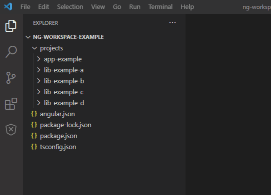

# Angular Workspace Project Excluder
## Features

Provides an easy way to exclude projects in Angular workspaces.

## How it works
The extension modifies the `settings.json` for the workspace.\
It modifies these settings:

| Setting | Description |
| - | - |
| `files.exclude` | Excludes files from the explorer and search |
| `files.watcherExclude` | Excludes files from the watcher |
| `git.ignoredRepositories` | Ignores git repositories |

A window reload is needed for these to kick in:  `files.watcherExclude`, `git.ignoredRepositories`.

## Release Notes
See Changelog
